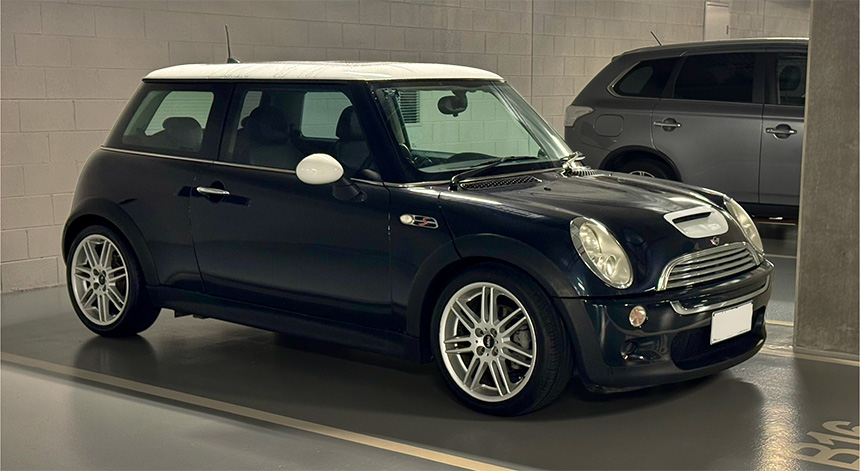

# Build Diary & Progress Updates

This section tracks progress through the Mini EV conversion project in a chronological format. Each entry documents what was achieved, lessons learned, and next actions. It serves both as a personal log and a reference for VASS certification and community transparency.

---

## 🔧 Entries

---

### 📅 2025-05-14  
**Stage:** First Update! EV Conversion Origin Story and Vehicle Acquisition  
**Summary:**  
I've been loving classic EV conversions on YouTube for a few years now, often thinking, "Maybe when I retire." This hesitation was mostly due to the perceived high cost of buying a classic car as a donor and acquiring EV components—options seemed limited to expensive Tesla setups or Hyper 9 motors.

Then one day, a video of an EV conversion using a Nissan Leaf appeared in my feed. I'd never seriously considered the Leaf before, as I found its design pretty uninspiring, and I'd assumed its EV components were low-end. However, watching the video, I saw just how straightforward the conversion process was, particularly with the Resolve EV controller that appeared quite plug-and-play. Intrigued, I started looking into them, discovering they weren't nearly as bad as I'd expected.

I checked the prices on the marketplace and found Leafs surprisingly affordable—around AUD 16,000 for a decent-looking secondhand 2016 model. Even more encouraging was finding out our existing second-hand Toyota could fetch up to AUD 8,000, making the transition to EV possibly feasible for our family without having to spend big. I wondered if we could simply use a second-hand Leaf as our family's first EV. But the allure of a classic conversion was strong.

Exploring further, I discovered enthusiasts successfully converting vehicles like the Mk1 VW Golf with Leaf components. This was promising, but when I discussed it with my wife, she was concerned about the safety of using older classics as a daily driver. So, I shifted focus toward more modern compact cars.

That's when the first-generation BMW Mini caught my attention. With its eight airbags and four-star ANCAP safety rating, it combined safety with a sporty, classic feel, and measures 550mm from CV joint to bonnet – critical for Leaf motor placement. I’d always loved the original classic Mini but had initially overlooked the refresh. After binge-watching countless reviews on YouTube, I began to appreciate its blend of performance and charm.

Ultimately, the decision was made—I’d get myself a 2004–2006 Mini Cooper S (The S has upgraded brakes and suspension), and embark on converting it to electric using Nissan Leaf parts. And just like that, my EV conversion journey began. Planning has been nightly. 

So after watching the market for a while i found one that suited, and today I picked up my Mini Cooper S. Very clean condition, VIN check confirmed good-ish history.

**Photos:**  
-  

**Next Steps:**
- Log CAN bus data from stock Mini
- Search for Leaf Parts

---
