# Mini EV Conversion Project 

  

2006 Mini Cooper S electric vehicle project, utilising components from a Gen 2 Nissan Leaf. This site serves as my primary documentation during the conversion. The goal is to build a practical, safe, and compliant daily driver by integrating Nissan Leaf electric vehicle (EV) components into a compact, sporty Mini Cooper 2006 chassis.

### Project Details:

- **Base Vehicle:** 2006 Mini Cooper S (R53)
- **Donor Parts:** Nissan Leaf Motor Stack, Nissan Leaf HV Battery, Nissan Leaf BMS
- **VCU** ZombieVerter VCU
- **Planned Budget:** Approximately $12,000 AUD
- **Projected Timeline:** Approximately 12 months

---

## More Project Decisions.
📅 24-08-2025

Another weekend, another round of decisions. This project is basically a long chain of “what’s the smartest, least painful way to do this?” moments, and every answer locks in the roadmap a bit further.

Here’s what got settled this time around:

Cooling → I’ll run the Leaf’s coolant pump through the Mini’s radiator loop. Simple, proven, and I don’t have to reinvent the plumbing.

Brakes → the Mini’s vacuum-assisted brakes need a new source of suck. The answer: an electric vacuum pump with a small reservoir, UP28/Leaf style.

Air Conditioning → this one’s still in motion, but the plan is to swap to a compatible electric compressor. There’s some work involved in making the Leaf’s unit happy outside its original home. Keeping the A/C is a must though — creature comforts matter.

Compliance → I pulled together a draft brief for the VACC engineer, mapping out how the build fits within NCOP and Vic regulations. It’s not the glamorous side of the project, but without it the car would never see the road again.

Taken together, these choices mean the car is edging out of “pile of parts” territory and into “actual system.” I can almost picture it: Leaf guts, Mini shell, and everything stitched together neatly. Almost.

---

## 3D Printed Dummy CV Stubs.
📅 17-08-2025

Sometimes progress comes from the simplest solutions. To keep the gearbox happy and not clanking during testing, I 3D printed dummy CV stubs. They’re not strong enough to handle torque, but perfect for alignment and noise reduction.

Filament: $0.50 Peace of mind: priceless.

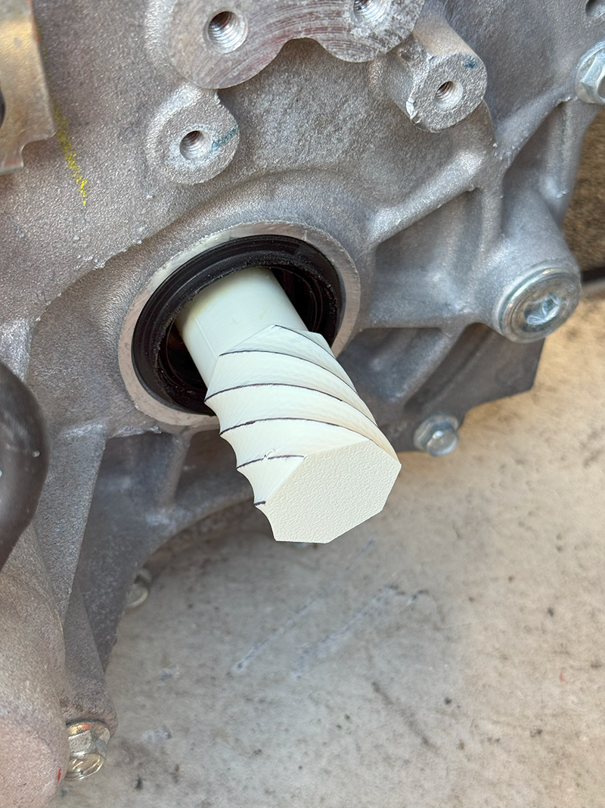
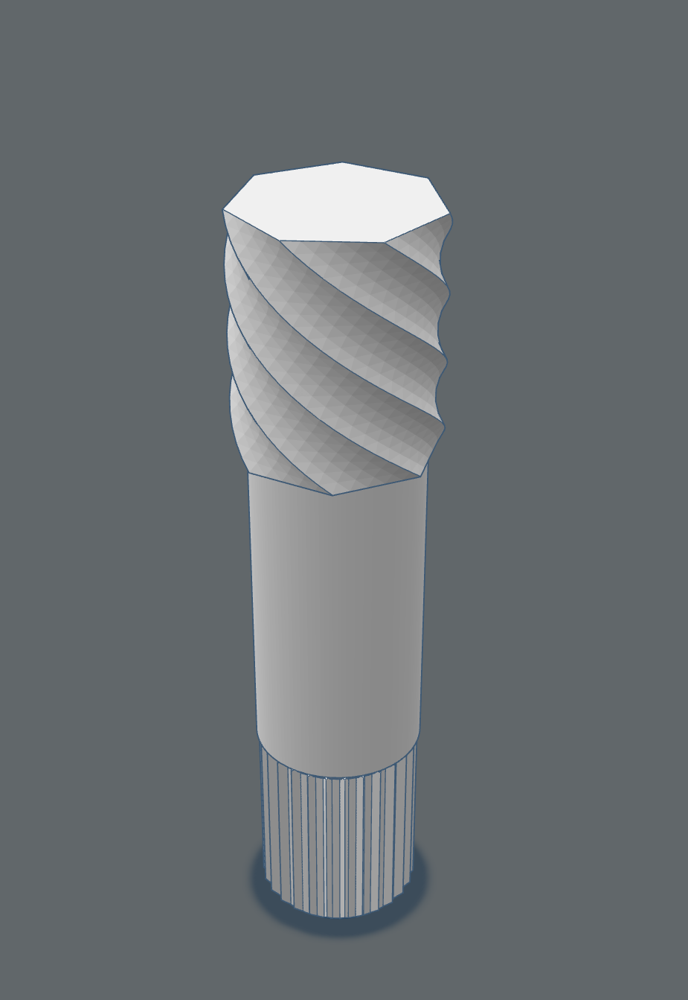

---

## First Spin.
📅 10-08-2025

The moment of truth. after getting everthing properly wired up I powered everything up, nudged the accelerator, and the Leaf motor spun for the first time.

At first, the gearbox made noises like it was being tortured. Turns out running it with no CVs installed is… not great. 

The ZombieVerter and wiring is all working though, so mostly win.

---

## Weighbridge.
📅 03-08-2025

Took the Mini to the weighbridge for baseline numbers: 760 kg front / 480 kg rear. That’s a lot of nose weight — no surprise for a supercharged front-driver.

These numbers will help with planning the EV layout. The goal is to get closer to a 60/40 split instead of a nose-heavy 65/35. Weight, in particular change in weight (kg & location) are important for VACC certification.

I used [GoWeigh](https://goweigh.com.au/), a 24 hour fully self service weighbridge, great system.

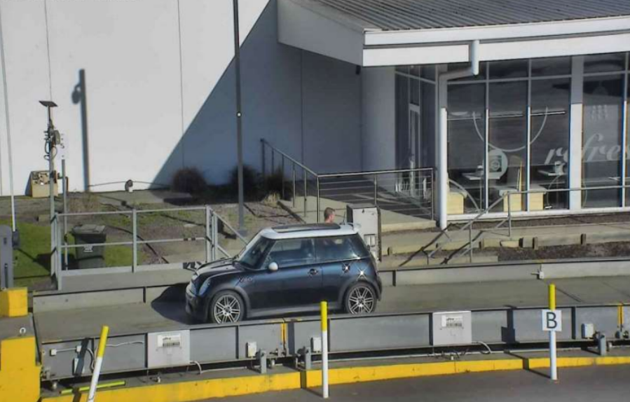

---

## Bench Setup.
📅 27-07-2025

This was the “garage laboratory” weekend. I set up the Leaf motor, inverter, charger, BMS, battery complete with contactors, precharge, and the ZombieVerter running on a bench.

There’s something deeply satisfying about seeing all the parts laid out, cabled together, and powered up. Like Lego, if Lego could electrocute you.

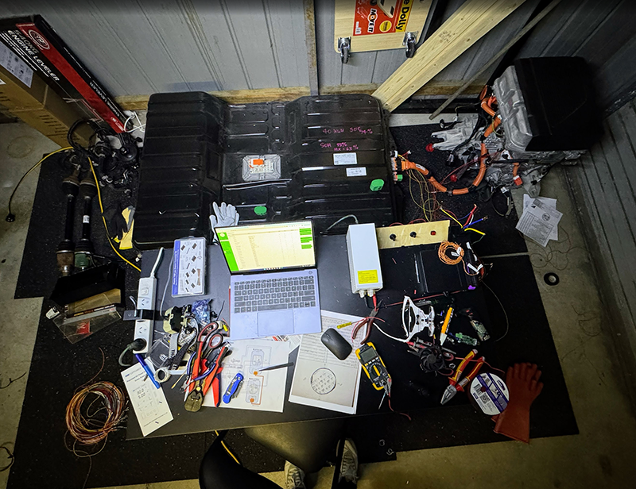

---

## Wiring Diagram v2.
📅 20-07-2025

As always, the first wiring diagram didn’t survive contact with reality. This weekend I refined the schematic into something cleaner and more accurate.

Less spaghetti, more clarity.

---

## Reading the Leaf Battery (BMS) + Connector.
📅 13-07-2025

First chance to really talk to the Leaf BMS. Using LeafSpy and a borrowed OBD dongle, I confirmed the pack’s health, voltage, and — most importantly — that it really was the 40 kWh pack. Relief!

This was also a chance to understand the connectors and pinouts. The Leaf battery isn’t exactly plug-and-play, so having a working mental map of how the BMS communicates is critical.

Also remixed a leaf 2013+ battery connector, making sure that only the required pins are exposed in the connector. Original [leaf 2013+ battery connector](https://github.com/dalathegreat/Nissan-Leaf-Battery-to-OBD2).

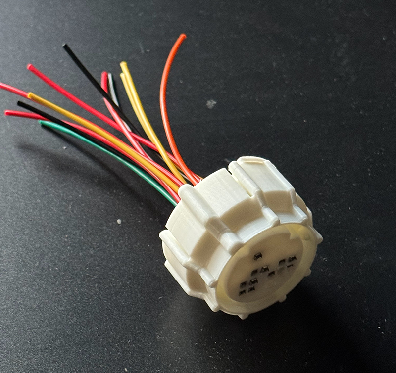

---

## ZombieVerter Diagram.
📅 05-07-2025

This weekend was mostly about documentation. I built a wiring diagram for my ZombieVerter setup, making sure all the relays, CAN channels, and safety loops were laid out clearly. I'm still not 100% on the connectors, my leaf stack seems to be 2019, wiring diagrams online don't seem to bethe same year.

Future-me will thank present-me for when I’m elbow-deep in wires.

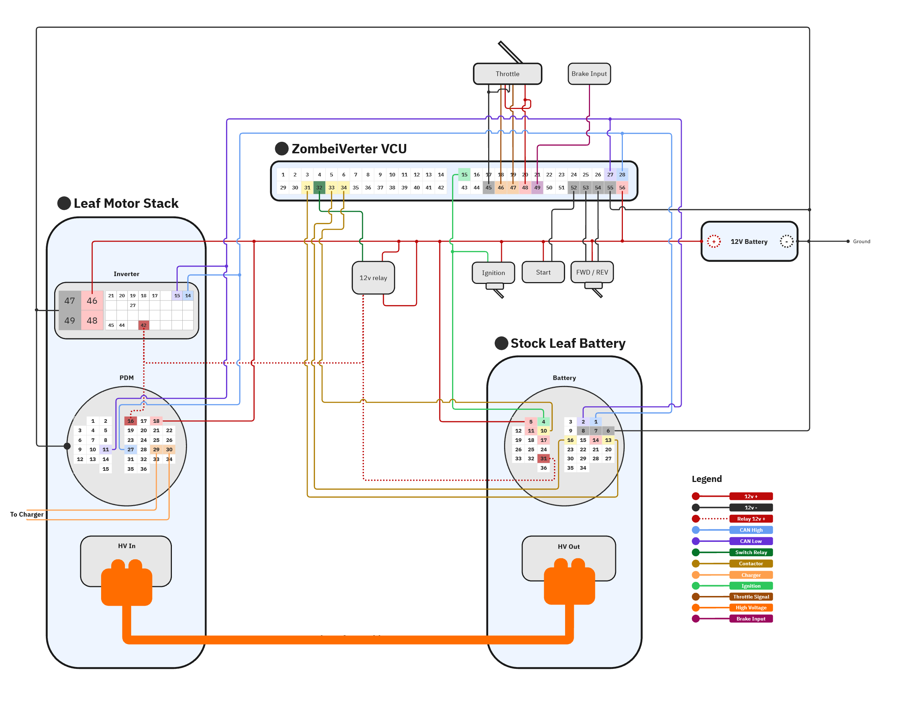

---

## Project Decisionss.
📅 14-06-2025

This weekend was all about locking in some of the bigger “how” questions. Up until now, the plan for controlling the Leaf stack had been a moving target:

First idea: use a Resolve EV controller. Solid, but pricey.

Then I shifted to the Open Inverter Leaf Board, which was cheaper and had an active community.

After some reading (and some sage advice on the Open Inverter forum), I've realised the current best route is the ZombieVerter VCU — better support, more features, and designed for exactly this kind of swap.

With that settled, a few other decisions clicked into place:

BMS → sticking with the Leaf BMS. Cheaper, simpler, and now supported by ZombieVerter.

Pedal → keeping the Mini’s stock accelerator pedal (dual hall sensors = neat, no bracket needed).

Battery layout → split between engine bay, fuel tank cavity, and boot for balance.

Canbus → This is a big one, I have found out that the Mini shares an almost identical Can to the BMW E46, and the ZombieVerter has that canbus pre-loaded, so my Canbus work is hopefully going to be minimal.

It feels good to have the high-level architecture locked in — fewer “what ifs,” more “let’s get building.”

---
  
## A Day at the Wreckers.
📅 07-06-2025

This was the day it all became tangible. I hired a ute and trailer, drafted my mum in as my trusty helper, and headed out to the wreckers.

Waiting at the front was a neat pile of parts, but the real treat was being allowed to ride shotgun with the picker into the Leaf graveyard. There, I cherry-picked what I needed:

Pedals (scored with loom attached, jackpot)

Full CV shafts

Gear shifter and wiring

Radiator and fans

And, of course, the main event: the Leaf’s battery pack. Around 200 kg of lithium chemistry, sitting on the ute tray. Getting it off at home was an Olympic event in leverage, and “don’t drop this or it’ll ruin your weekend.”

To add a bit of drama, one of the staff casually said, “Yeah, I think that’s a 24 kWh pack.”, the pack says 24kWh on the official sticker but says 40kWh on the case in marker, will need to read it and find out.

By the end of the day, my garage looked like a DIY EV starter kit exploded across it.

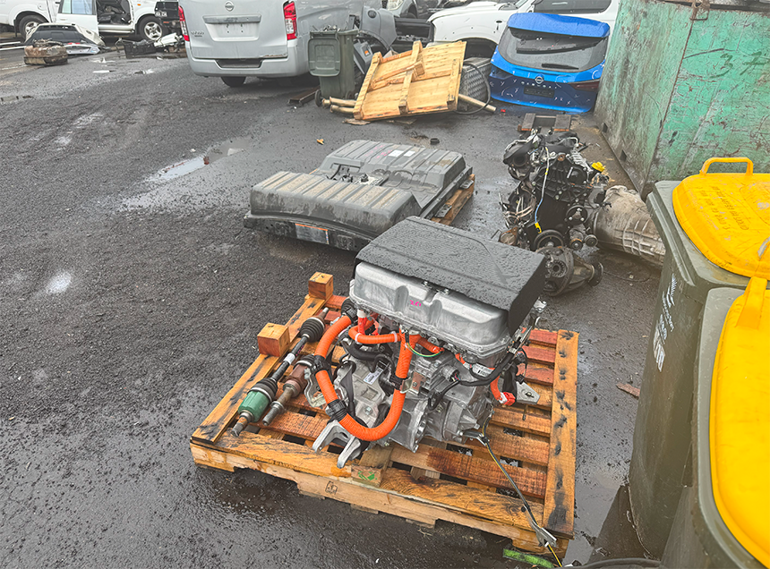 
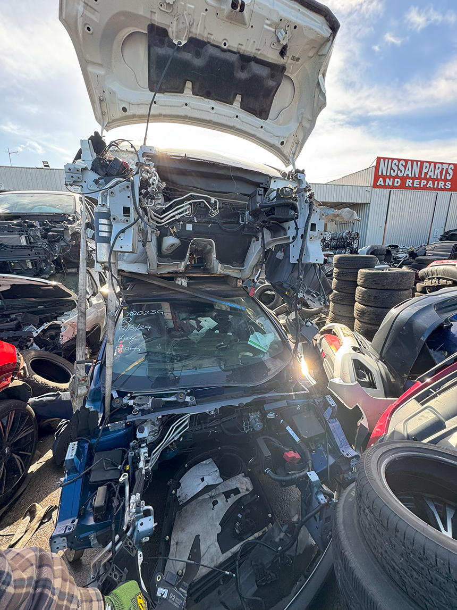 
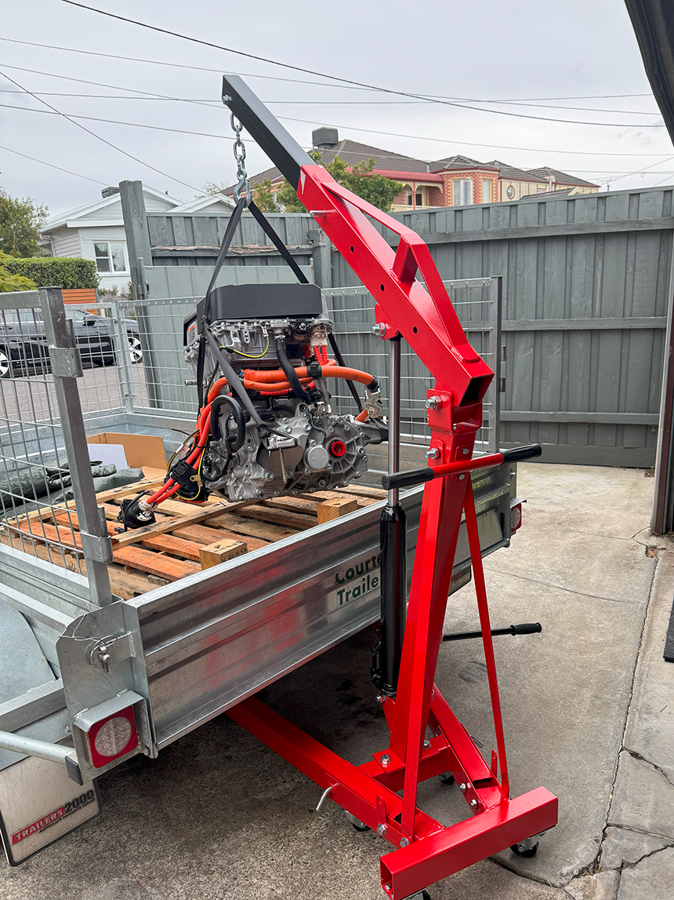 
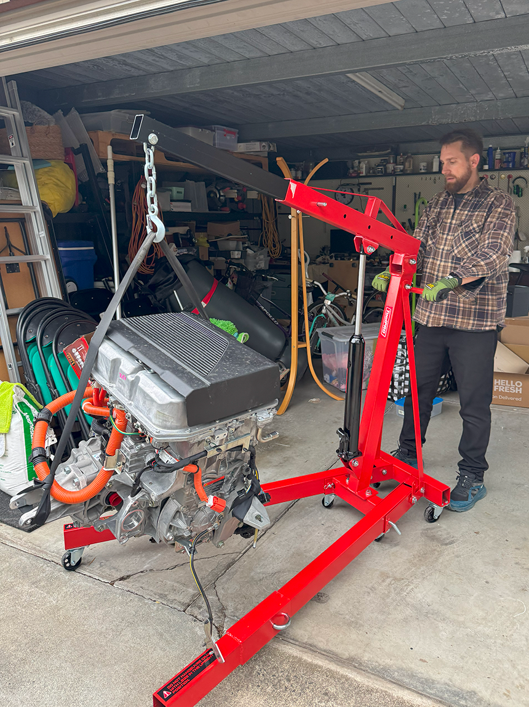 
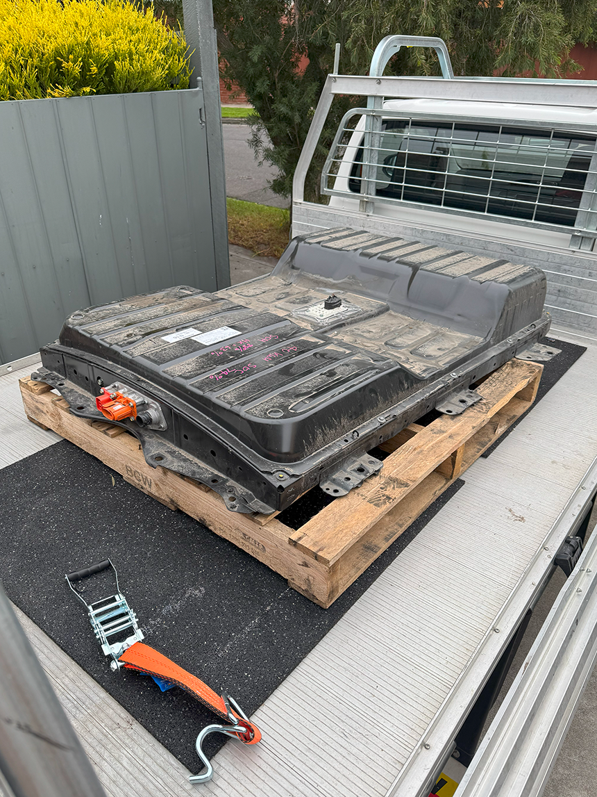 
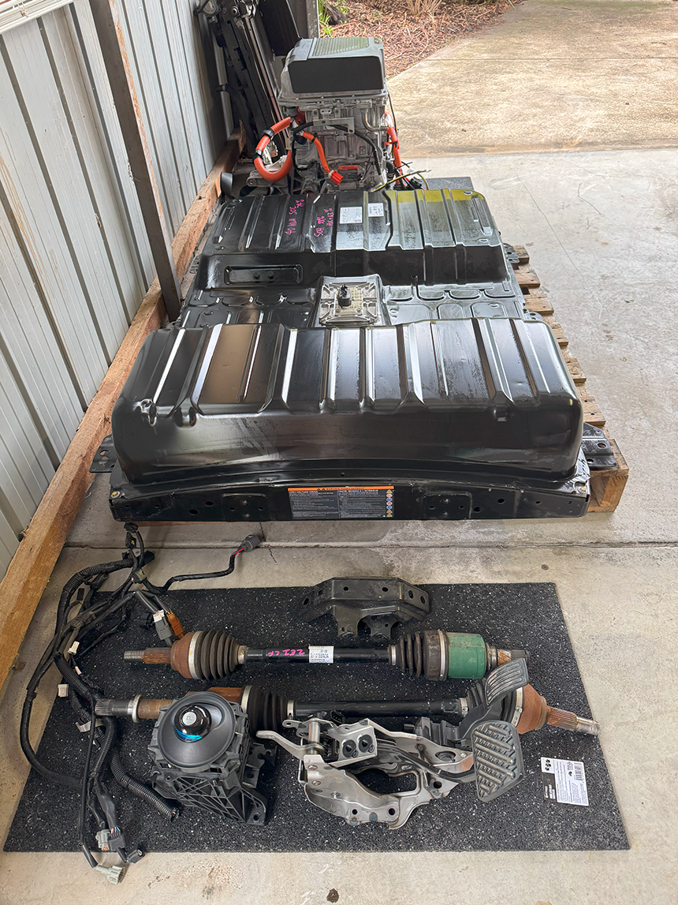 

---
 
## Quick Update – Wrecker Came Through.
📅 29-05-2025 

Just got off the phone with the guy I have been dealing with, and it sounds like he's going to include the extra parts I asked about in the $5,500 bundle price.

They’re likely throwing in:
- The battery harness and service disconnect
- Gear selector
- Accelerator pedal
- Possibly the OBD-II port and some fuse/relay gear
- And even the charging port + harness

This means I now have nearly everything I need to build a working EV powertrain, all for the one price.

Happy with the outcome, this takes a lot of pressure off the parts hunt. Payment’s in, and next step is to pick it all up and start the bench test phase.

**Next Steps:**
- Finish clearing the shed ready for Leaf parts

---

## Locking In the Drivetrain – Invoice Received and Paid
📅 28-05-2025  

Big milestone: I put my money where my mouth is and officially locked in the Leaf drivetrain. Invoice received, invoice paid.

There’s no going back now. Soon, a Leaf motor, inverter, charger, and battery pack will be mine. This is the point in the story where the sensible part of your brain starts whispering “you could’ve just bought a second-hand i3, you know” — but honestly, where’s the fun in that?

---

  
## Logging CAN bus data from Mini
📅 17-05-2025

If you want to make a modern car accept a heart transplant, you need to speak its language: CAN bus. This weekend was all about tapping into the Mini’s network and logging data.

Armed with an ESP32, some open-source wizardry, and a healthy amount of trial and error, I finally started seeing live messages scroll across my laptop. Most of them made zero sense at first glance, but the point is: the Mini talks, and now I can listen.

This data will be help later, when I need to spoof BMW/Mini messages so the dash, ABS, and other systems still play nicely. Baby steps, but an important one.

---
 
## Mini driving and light repairs  
📅 03-05-2025 

With the Mini still roadworthy, I've been using it as my daily driver — it's such a fun car to drive.

Of course, being a nearly 20-year-old Mini, it had quirks. A steering fluid leak here, a battery tantrum there. Nothing catastrophic, but enough to make me feel like I hadn’t bought the world’s cleanest example after all. Still, these issues will literally get thrown out with the petrol drivetrain, so I'm not losing much sleep.

One last hurrah for the ICE setup before the surgery begins.

---

## Finding Nissan EV Parts from a Wrecker
📅 26-04-2025 

Rule number one of an EV swap: you need EV bits. Preferably ones that don’t cost more than the car itself. So I started hunting Nissan Leaf wrecks on Marketplace, calling wreckers, and trawling forums.

I've found a Gen 2 Leaf drivetrain — motor, inverter, charger, and battery pack. Bonus: the wreckers had enough ancillary parts (coolant pump, pedals, wiring stubs) that I wouldn’t be starting from scratch with a spaghetti of connectors.

The plan was now solid: Leaf power in a Mini body.

---

## First Update! EV Conversion Origin Story and Vehicle Acquisition  
📅 20-04-2025 

Every harebrained project needs an origin story, so here’s mine: I decided to take a perfectly good 2006 Mini Cooper S R53 and replace its screaming supercharged petrol engine with a Nissan Leaf drivetrain. Why? Because EVs are fun, Minis are fun, and smashing the two together sounds like the kind of problem-solving chaos I live for.

I spent some time weighing up options — old Golfs, other donor cars, even five-door “sensible” choices to keep the family happy. But in the end, the Mini won out. It’s compact, characterful, has 8 airbags, and exactly the sort of car that deserves a new lease on life.

So here we are: project launched, car purchased, and my weekends booked out for the foreseeable future.

