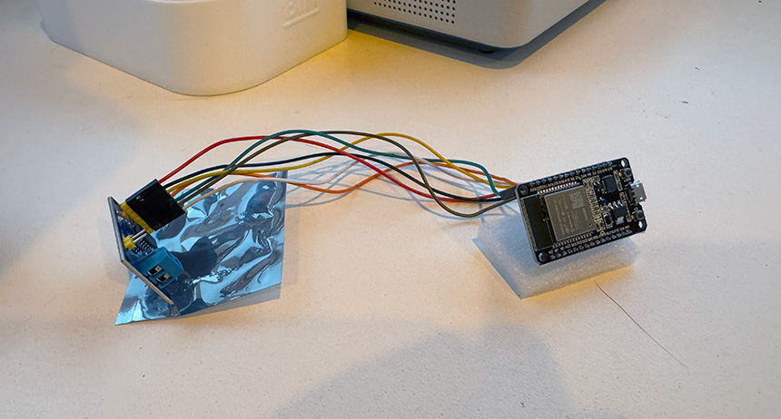

# Mini EV Conversion Project 

  

2006 Mini Cooper S electric vehicle project, utilising components from a Gen 2 Nissan Leaf. This site serves as my primary documentation during the conversion. The goal is to build a practical, safe, and compliant daily driver by integrating Nissan Leaf electric vehicle (EV) components into a compact, sporty Mini Cooper 2006 chassis.

### Project Details:

- **Base Vehicle:** 2006 Mini Cooper S (R53)
- **Donor Vehicle:** Nissan Leaf (Gen 2, 2018)
- **VCU** ZombieVerter VCU
- **Planned Budget:** Approximately $12,000 AUD
- **Projected Timeline:** Approximately 12 months

---

📅 07-06-2025  
## A Day at the Wreckers.

Today was a good day, hired a ute and trailer to pickup all of the parts from the wreckers.

 
 
 
 
 
 

**Next Steps:**
- More planning, start designing the wiring diagram

---

📅 29-05-2025  
## Quick Update – Wrecker Came Through.

Just got off the phone with the guy I have been dealing with, and it sounds like he's going to include the extra parts I asked about in the $5,500 bundle price.

They’re likely throwing in:
- The battery harness and service disconnect
- Gear selector
- Accelerator pedal
- Possibly the OBD-II port and some fuse/relay gear
- And even the charging port + harness

This means I now have nearly everything I need to build a working EV powertrain, all for the one price.

Happy with the outcome, this takes a lot of pressure off the parts hunt. Payment’s in, and next step is to pick it all up and start the bench test phase.

**Next Steps:**
- Finish clearing the shed ready for Leaf parts

---

#### 📅 28-05-2025  
## Locking In the Drivetrain – Invoice Received and Paid

After weeks of back-and-forth with the wrecker, I finally received the written quote for the Nissan Leaf ZE1 parts I need — and it was better than expected.

The total came to $5,500 AUD, which includes:

- The EM57 electric motor
- Inverter
- Single-speed gearbox
- Driveshafts
- Charger
- And most importantly, the Gen 2 Leaf battery pack

This bundle covers nearly everything I need for the heart of the conversion. It wasn’t itemised, but the description matched what we discussed — and at this price, I’m not going to make a fuss over whether the gear selector or pedal is included. I can pick up those extras separately if needed.

**Next Steps:**
- Organise pickup and start prepping for a bench test of the Leaf components before pulling the Mini apart.

---

#### 📅 17-05-2025  
## Logging CAN bus data from Mini

**Summary:** 
I spent Friday night and Saturday morning attempting to get setup to log the can data from the Mini. I set out to use an ESP32 dev board with an MCP2515 CAN module to interface with SavvyCAN via the GVRET protocol.

What I Tried:

- Started with an ESP32-WROOM DevKit board (with CP2102 USB-to-Serial)
- Connected the MCP2515 via SPI (CS=GPIO5, INT=GPIO4, SCK/MISO/MOSI=18/19/23)
- Flashed the ESP32RET firmware using PlatformIO and Arduino IDE
- Attempted to connect using SavvyCAN’s GVRET Serial mode at 115200 and 1000000 baud
- Saw serial output and CAN initialization logs, but SavvyCAN failed handshake consistently

What I Learned:

- CP2102-based ESP32 boards do not reliably support 1M baud, causing GVRET Serial to become garbled and fail
- ESP32RET and SavvyCAN expect a clean GVRET binary stream — any noise (e.g., ELM emulator or debug prints) causes the handshake to fail

 
 

**Next Steps:**
- I’ve ordered a few ESP32 boards with CH340 USB chips, which support 1,000,000 baud for GVRET serial communication with SavvyCAN. Once they arrive, I’ll resume testing with the precombiled ESPRET bin.
---

#### 📅 03-05-2025  
## Mini driving and light repairs  

**Summary:**  
The Mini truly is a joy to drive. Its cornering capabilities are fantastic. Even if I never get around to completing the EV conversion, I'll still be happy with the car. However, I'm looking forward to the instant torque. Based on current projections using the Mini specs combined with the Leaf motor and battery setup, the car might achieve 0–100 km/h in ~5ish seconds!

So far, I've tackled several small repairs and improvements:

- Fluid leak: Initially alarming, the fluid under the car turned out to be power steering fluid. Thankfully, it was an easy fix—one of the hoses just wasn't properly tightened. Considering I'll retain the power steering, I'll likely replace the old hardened hoses for peace of mind.
- Stereo issue: The audio system was annoyingly only playing through one side of the car. I learned how to remove the stereo (a bit tricky!) and discovered some bad wiring behind the aftermarket Pioneer unit. I resolved the wiring issue but will probably upgrade to a double DIN Android head unit soon.
- Door latch: The driver's side door wasn’t closing properly, but a quick adjustment of the latch mechanism sorted that out.
- Bonnet scoop: I found the bonnet scoop attached rather poorly with some dodgy silicone work. I cleaned everything up and 3D printed new clips to secure it correctly.
- Given that it's a 19-year-old vehicle, I expect to tackle more issues along the way, but that's all part of the fun.

**Next Steps:**
- Log CAN bus data from stock Mini

---

#### 📅 26-04-2025  
## Finding Nissan EV Parts from a Wrecker

**Summary:** 
The next step is sourcing the Nissan Leaf components. I have found several wrecked Nissan Leafs online at local wreckers. I called a wrecker specializing in Nissan vehicles—they had three Nissan Leaf Gen 2s listed on their website.

The first phone conversation was encouraging. The guy I spoke with was incredibly friendly and knowledgeable, having previously sold a few DIY EV kits. To my surprise, the quoted price was very reasonable—AUD 5,500 for a complete Gen 2 drivetrain and battery.

I decided to visit the wrecker in person to discuss further and inspect the vehicles. The yard was in full swing, diggers moved wrecks around, workers were busy everywhere. My initial encounter at the front desk was less welcoming, greeted by a rather surly employee who seemed disinterested in me as a whole. However, after some friendly questions, I managed to win him over. He eventually shared details on the purchase process and logistics but drew the line when I asked to see the actual vehicle. "It's a car—what are you going to see?", making it clear he wouldn’t budge.

Feeling optimistic.

**Next Steps:**
- Lock down a quote and pickup date with the wreckers

---

#### 📅 20-04-2025  
## First Update! EV Conversion Origin Story and Vehicle Acquisition  

**Summary:**  
I've been loving watching classic EV conversions on YouTube for a few years now, often thinking, "Maybe when I retire." This hesitation was mostly due to my perceived high cost of buying a classic car as a donor and acquiring EV components—options seemed limited to expensive Tesla setups or Hyper 9 motors.

Then one day, a video of an EV conversion using a Nissan Leaf appeared in my feed. I'd never seriously considered the Leaf before, as I found its design pretty uninspiring, and I'd assumed its EV components were low-end. However, watching the video, I saw just how straightforward the conversion process was, particularly with the Resolve EV controller that appeared quite plug-and-play. I started looking into them, discovering they weren't nearly as bad as I'd expected.

I checked the prices on the marketplace and found Leafs surprisingly affordable—around AUD 16,000 for a decent-looking secondhand 2016 model. I wondered if we could simply use a second-hand Leaf as our family's first EV. But the allure of a classic conversion was strong.

Exploring further, I discovered enthusiasts successfully converting vehicles like the Mk1 VW Golf with Leaf components. This was promising, but when I discussed it with my wife, she was concerned about the safety of using older classics as a daily driver. So, I shifted focus toward more modern compact cars.

I thought about a few possible cars, but landed on first-generation BMW Mini. Eight airbags and four-star ANCAP safety rating, it combines safety with a sporty, classic feel, and measures 550mm from CV joint to bonnet – should fit the Leaf motor. I’d always loved the original classic Mini but had initially overlooked the refresh. After binge-watching countless reviews on YouTube, I liked its blend of performance and charm.

Ultimately, the decision was made—I’d get myself a 2004–2006 Mini Cooper S (The S has upgraded brakes and suspension), and embark on converting it to electric using Nissan Leaf parts. And just like that, my EV conversion journey began. Planning has been nightly. 

So after watching the market for a while I found one that suited, clean condition, VIN check confirmed good-ish history.

**The Mini:**  
-  

**Next Steps:**
- Search for Leaf Parts

---

